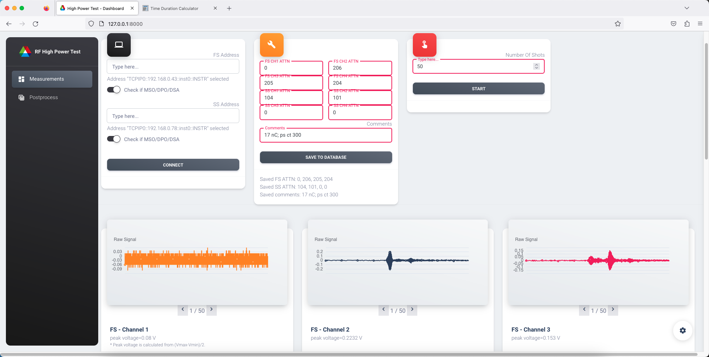
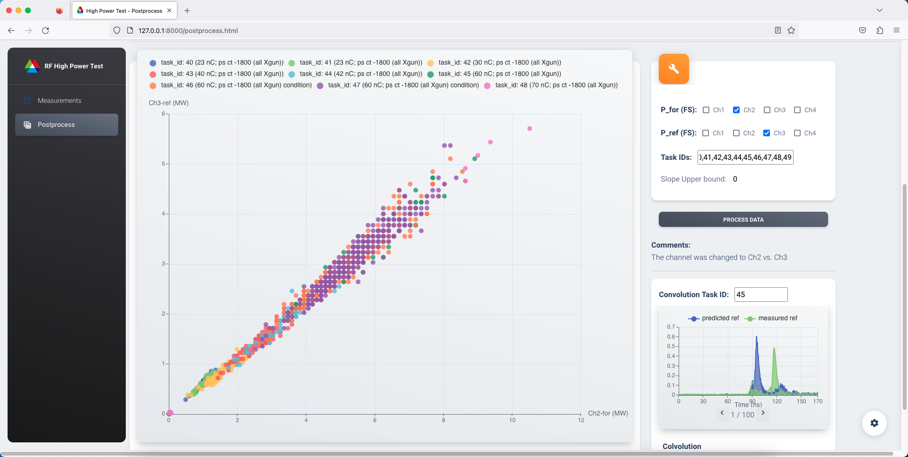

# Control panel for high power rf test

This project is a locally deployed application built using the Django framework. It is designed to conduct high-power rf tests at AWA and can be used for controlling up to two Tektronix scopes. The application is capable of performing basic rf data processing tasks, including preliminary power calculations, signal convolution etc.

## Project structure
```
hp-test-control-panel/
    manage.py   <= Django project management utility
    apps/
        __init__.py
        config.py
        context_processors.py
        data_process_temp.json  <= temporarily stored UI data for online data processing
        store.json  <= temporarily stored scope data
        home/
            admin.py
            apps.py
            data_processing.py  <= functions for rf data processing
            hardware_settings.py    <= hardware info for online rf data processing (cable loss etc.)
            models.py   <= model classes defining the structure of the database schema
            scope_control.py    <= functions for scope control and data acquisition  
            urls.py
            views.py    <= functions for processing user requests (`take data` etc.)
            templates/
                home/
                    measurement.html    <= measurement panel
                    postprocess.html    <= postprocess panel
                    notifications.html
                    template.html

            migrations/
            static/
    RFtest/
        __init__.py
        asgi.py
        settings.py
        urls.py
        wsgi.py
    static/ 
        assets/
            css/
            js/
            fonts/
            img/
    db.sqlite3  <= database for high power test data
```

## Panel screenshots



## Usage
The project has been developed and tested on Mac OS, including systems with Intel and M1 chips. It's recommended to verify the compatibility of your LabVIEW version with Apple Silicon. 

Update: Starting from LabVIEW 2023 Q3, the macOS version offers native support for Apple Silicon (M1/M2) processors, instead of relying on Rosetta 2.

```Shell
$ python manage.py migrate
Operations to perform:
  Apply all migrations: admin, auth, contenttypes, home
Running migrations:
  Applying contenttypes.0001_initial... OK
  Applying auth.0001_initial... OK
  Applying admin.0001_initial... OK
  Applying admin.0002_logentry_remove_auto_add... OK
  Applying admin.0003_logentry_add_action_flag_choices... OK
  Applying contenttypes.0002_remove_content_type_name... OK
  Applying auth.0002_alter_permission_name_max_length... OK
  Applying auth.0003_alter_user_email_max_length... OK
  Applying auth.0004_alter_user_username_opts... OK
  Applying auth.0005_alter_user_last_login_null... OK
  Applying auth.0006_require_contenttypes_0002... OK
  Applying auth.0007_alter_validators_add_error_messages... OK
  Applying auth.0008_alter_user_username_max_length... OK
  Applying auth.0009_alter_user_last_name_max_length... OK
  Applying auth.0010_alter_group_name_max_length... OK
  Applying auth.0011_update_proxy_permissions... OK
  Applying auth.0012_alter_user_first_name_max_length... OK
  Applying home.0001_initial... OK
$ python manage.py makemigrations
No changes detected
$ python manage.py runserver
```
## Acknowledgment
This project employs a Django template provided by [AppSeed](https://appseed.us/).